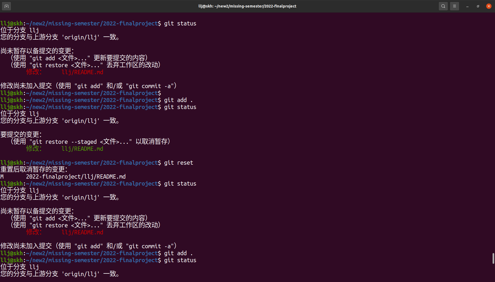
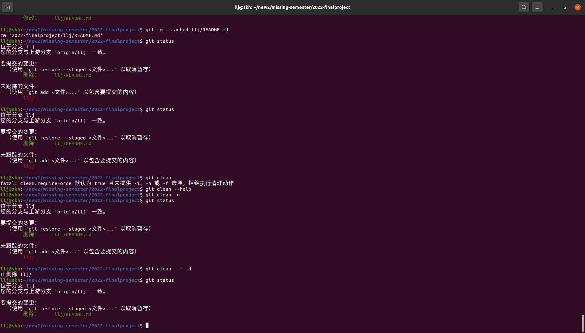
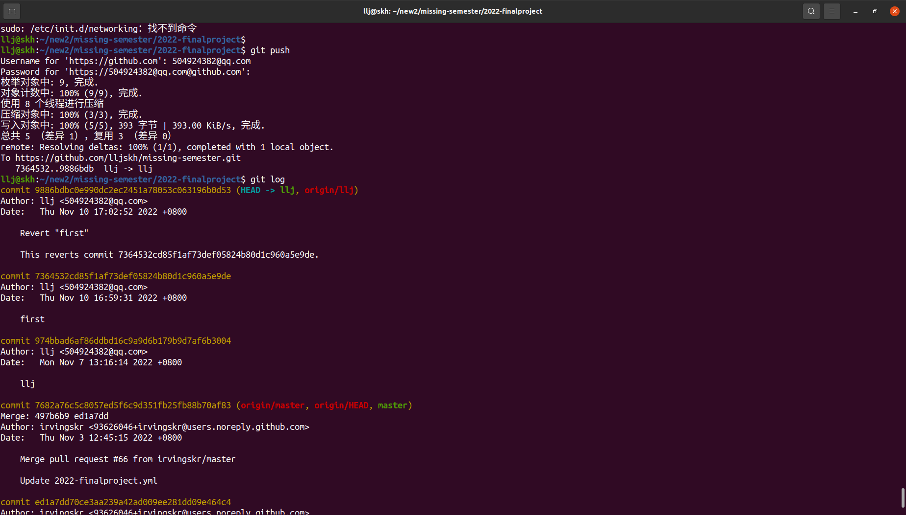
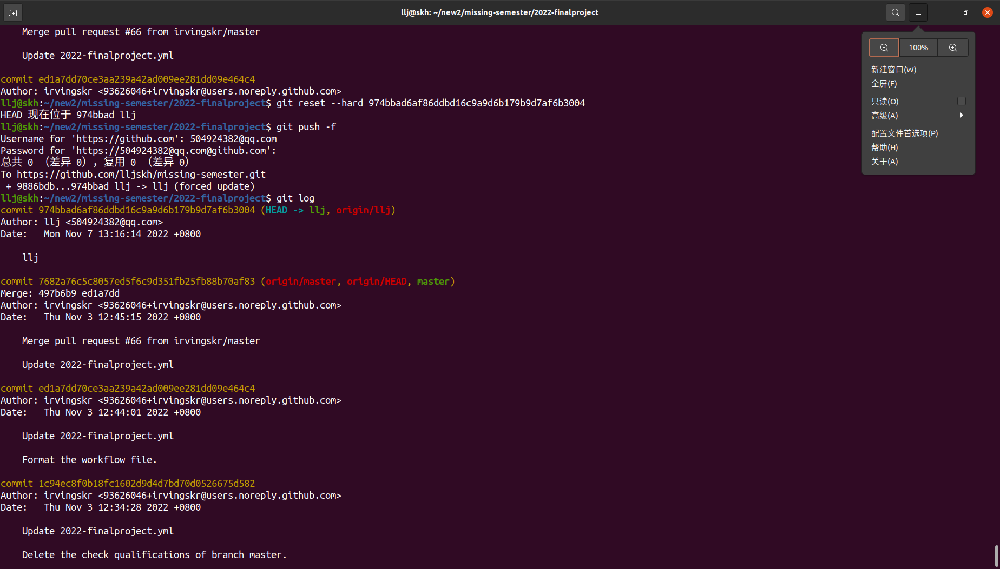
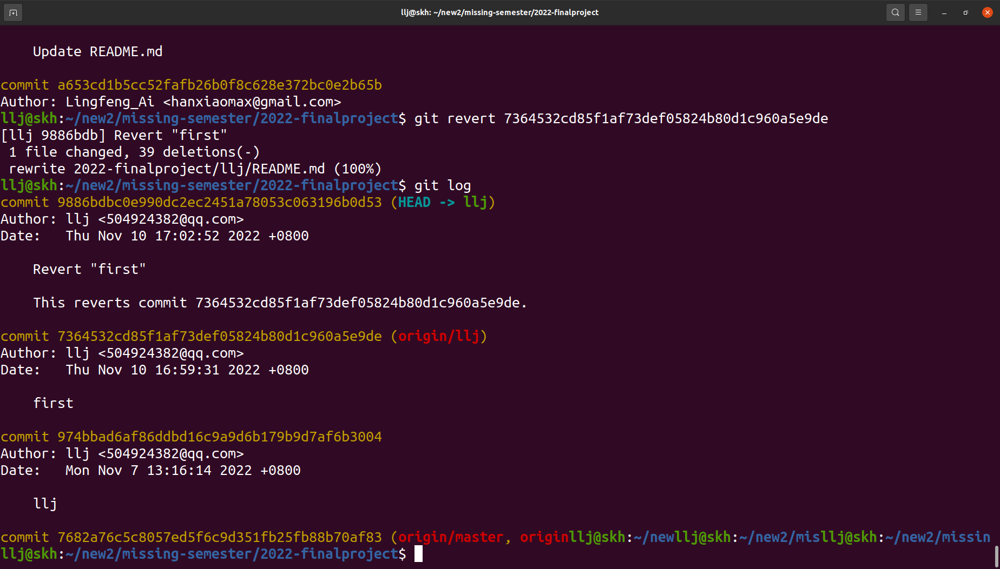
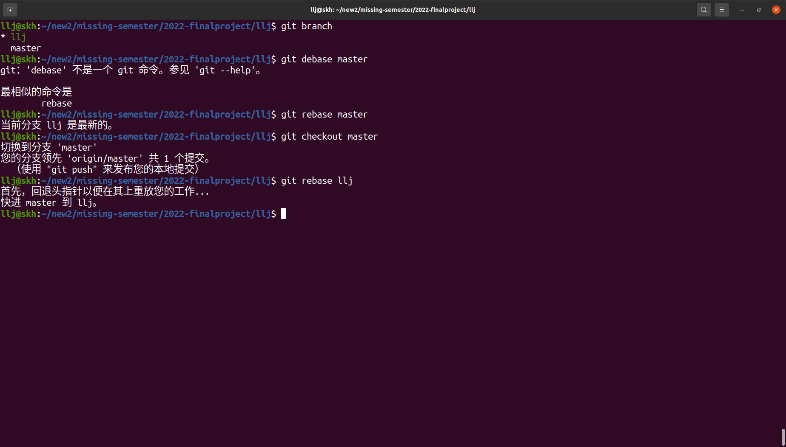
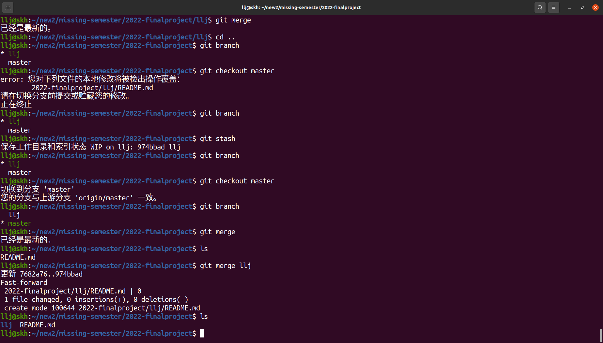

# git运用

## 第一题：

- ```
  git reset
  ```

  当执行 `git reset HEAD`命令时，暂存区的目录树会被重写，被 master 分支指向的目录树所替换，但是工作区不受影响。

  

  


- ```
  git rm --cached 
  ```

  当执行 `git rm --cached <file>` 命令时，会直接从暂存区删除文件，工作区则不做出改变。




## 第二题

- ```
  git reset（不修改历史）
  ```

  `git reset` 主要是通过`git reset --sort` 回退到某个版本，然后通过`git push -f`强制去覆盖已有版本，同时会把版本号之后的修改记录给覆盖






- ```
  git revert（修改历史）
  ```

  `git revert` 则比较温和，他会留下修改记录

  


## 第三题

- ```
  git debase
  ```

  `git debase`相比于`git merge`它的提交是线性的，更加清晰可读。

  


- ```
  git merge
  ```

  `git merge`在解决冲突上更加方便

  